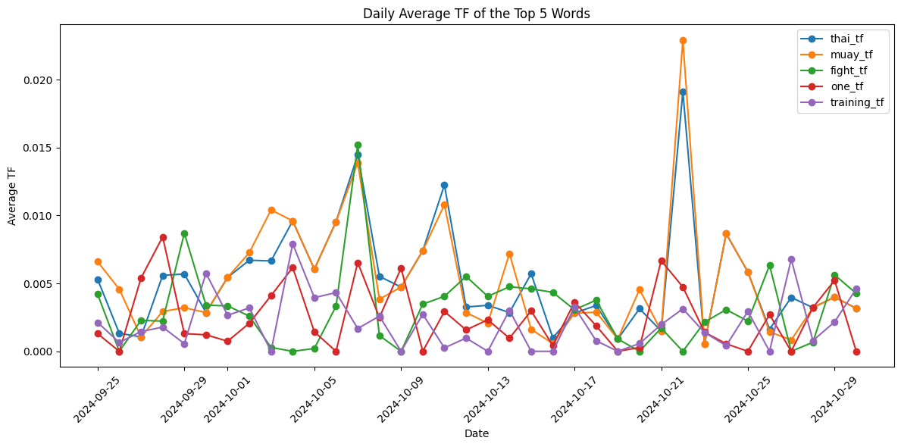

# Text Analysis of Martial Arts-related Subreddits

The purpose of this project is to analyse the differences and similarities between different subreddits existing around a common topic, in this case martial arts. At first, I will collect Reddit data, analyse TF-IDF scores, and attempt to classify the subreddits using k-means and Naive Bayes algorithms. Then, I will introduce networks to visualise connections between threaded comments and users. Finally, I will make use of embeddings to further the analysis.

## I/ Collecting Reddit Data and Exploring TF-IDF Results


```python
# Setup autoreload
%load_ext autoreload
%autoreload 2

# Create README.md 
# pip3 install nbconvert
# jupyter nbconvert --execute --to markdown MartialArtsRedditAnalysis.ipynb
# then rename to README.md
```


```python
from reddit_helper import *
import os
import pyarrow
import pickle
from datetime import datetime, timezone
from dateutil import tz
import matplotlib.pyplot as plt
```

Let's first collect  50 posts from the r/MuayThai, r/bjj, r/MMA, and r/Boxing subreddits, and display some of their initial characteristics. This is done using the `RedditScraper` class created in the `reddit_helper.py` file. 


```python
# Example subreddits
subreddits = ['MuayThai', 'bjj', 'MMA', 'Boxing']

# Establish cache directory
CACHE_DIR = os.path.join(os.getcwd(), 'data')

# Analysis parameters
MAX_TERMS = 1000
MIN_DOC_FREQ = 2
TOP_N = 10
# LIMIT = 50 Initial limit at 50 for testing
LIMIT = 500
USERNAME = "matteolarrode"

# Initialize scraper
scraper = RedditScraper(
user_agent=f"SDS_textanalysis/1.0 (by /u/{USERNAME})"
)

# Analyze each subreddit independently
results = {}
submissions = {}

for subreddit in subreddits:
    print(f"\nAnalyzing r/{subreddit}...")

    # Define the cache file path for this subreddit
    cached_file = os.path.join(CACHE_DIR, f"{subreddit}_data.pkl")

    # If the data for the subreddit is already cached, no need to collect
    if os.path.exists(cached_file):
        # Load data from cache
        print(f"Loading cached data for r/{subreddit}...")
        with open(cached_file, 'rb') as file:
            submissions[subreddit] = pickle.load(file)
    
    # Otherwise, collect posts and cache them
    else:
        submissions[subreddit] = scraper.get_subreddit_posts(subreddit, limit=LIMIT)
        with open(cached_file, 'wb') as file:
            pickle.dump(submissions[subreddit], file)

    # Analyze subreddit
    results[subreddit] = analyze_subreddit(
        submissions[subreddit],
        max_terms=MAX_TERMS,   # Maximum number of terms to keep
        min_doc_freq=MIN_DOC_FREQ,   # Term must appear in at least min_doc_freq documents
        top_n_terms=TOP_N # Number of top terms returned in result
    )

    # Print results for this subreddit
    print(f"\nVocabulary Statistics for r/{subreddit}:")
    print(f"Total words: {results[subreddit]['vocab_stats']['total_words']}")
    print(f"Unique words: {results[subreddit]['vocab_stats']['unique_words']}")
    print(f"Words appearing ≥{MIN_DOC_FREQ} times: {results[subreddit]['vocab_stats']['words_min_freq']}")
    print(f"Coverage by top {MAX_TERMS} words: {results[subreddit]['vocab_stats']['coverage_top_1000']:.2f}%")
    print(f"Matrix shape: {results[subreddit]['matrix_shape']}")
    print(f"Matrix sparsity: {results[subreddit]['matrix_sparsity']:.2f}%")

    print(f"\nTop {TOP_N} terms by TF-IDF score:")
    print(results[subreddit]['top_terms'][['term', 'score']].to_string())
```

    
    Analyzing r/MuayThai...
    Loading cached data for r/MuayThai...
    
    Vocabulary Statistics for r/MuayThai:
    Total words: 38142
    Unique words: 5155
    Words appearing ≥2 times: 2384
    Coverage by top 1000 words: 82.93%
    Matrix shape: (500, 1000)
    Matrix sparsity: 97.76%
    
    Top 10 terms by TF-IDF score:
             term     score
    860      thai  0.051784
    527      muay  0.050555
    266     fight  0.042132
    388        im  0.035211
    932        vs  0.030987
    560       one  0.029892
    907  training  0.025881
    454      like  0.025353
    776  sparring  0.022809
    307       get  0.022165
    
    Analyzing r/bjj...
    Loading cached data for r/bjj...
    
    Vocabulary Statistics for r/bjj:
    Total words: 46080
    Unique words: 5572
    Words appearing ≥2 times: 2717
    Coverage by top 1000 words: 83.23%
    Matrix shape: (500, 1000)
    Matrix sparsity: 97.37%
    
    Top 10 terms by TF-IDF score:
           term     score
    91      bjj  0.045379
    387      im  0.037150
    465    like  0.033840
    306      gi  0.029001
    331   guard  0.027802
    303     get  0.027212
    337     gym  0.026797
    83     belt  0.026350
    45   anyone  0.022571
    318    good  0.022170
    
    Analyzing r/MMA...
    Loading cached data for r/MMA...
    
    Vocabulary Statistics for r/MMA:
    Total words: 22560
    Unique words: 4138
    Words appearing ≥2 times: 1872
    Coverage by top 1000 words: 81.11%
    Matrix shape: (500, 1000)
    Matrix sparsity: 98.31%
    
    Top 10 terms by TF-IDF score:
            term     score
    945       vs  0.068716
    916      ufc  0.062746
    334    fight  0.048343
    825  spoiler  0.038150
    50       308  0.027530
    567      mma  0.024670
    512     link  0.023135
    630  oktagon  0.022059
    897    title  0.019960
    345    flair  0.018679
    
    Analyzing r/Boxing...
    Loading cached data for r/Boxing...


    
    Vocabulary Statistics for r/Boxing:
    Total words: 34765
    Unique words: 5074
    Words appearing ≥2 times: 2429
    Coverage by top 1000 words: 81.35%
    Matrix shape: (500, 1000)
    Matrix sparsity: 97.93%
    
    Top 10 terms by TF-IDF score:
              term     score
    932         vs  0.046524
    314      fight  0.045823
    143     boxing  0.035954
    132      bivol  0.032466
    122  beterbiev  0.031438
    68         amp  0.020896
    88       artur  0.015270
    869      think  0.015031
    883      title  0.014548
    624        one  0.014423


Let's try to grasp a better understanding of the data structure of the `results` object. It is a dictionary with the following keys:


```python
print(results['MuayThai'].keys())
print(results['MuayThai']['vocab_stats'].keys())
```

    dict_keys(['vocab_stats', 'freq_distribution', 'top_terms', 'vectorizer', 'matrix_shape', 'matrix_sparsity'])
    dict_keys(['total_words', 'unique_words', 'words_min_freq', 'coverage_top_1000'])


- `vocab_stats` is itself a dictionary which contains some statistics on the vocabulary present in the posts of the subreddit.
- `top_terms` returns a number of the top terms by TF-IDF defined by the `TOP_N` constant.

Also, the code has been written so that the first time it is run to query the posts of a subreddit, the data is cached in `/data` for later use as a `pickle` file (`/data` is in the .gitignore). Note that `.pkl` files can only be read in Python.

### Some exploratory data analysis

First, I will **plot keywords over time**. Each post is a dictionary, and its creation Unix timestamp is associated to te `created_utc` key. 


```python
print(f"Keys of each post: {submissions['MuayThai'][0].keys()}")
```

    Keys of each post: dict_keys(['approved_at_utc', 'subreddit', 'selftext', 'author_fullname', 'saved', 'mod_reason_title', 'gilded', 'clicked', 'title', 'link_flair_richtext', 'subreddit_name_prefixed', 'hidden', 'pwls', 'link_flair_css_class', 'downs', 'thumbnail_height', 'top_awarded_type', 'hide_score', 'name', 'quarantine', 'link_flair_text_color', 'upvote_ratio', 'author_flair_background_color', 'subreddit_type', 'ups', 'total_awards_received', 'media_embed', 'thumbnail_width', 'author_flair_template_id', 'is_original_content', 'user_reports', 'secure_media', 'is_reddit_media_domain', 'is_meta', 'category', 'secure_media_embed', 'link_flair_text', 'can_mod_post', 'score', 'approved_by', 'is_created_from_ads_ui', 'author_premium', 'thumbnail', 'edited', 'author_flair_css_class', 'author_flair_richtext', 'gildings', 'content_categories', 'is_self', 'mod_note', 'created', 'link_flair_type', 'wls', 'removed_by_category', 'banned_by', 'author_flair_type', 'domain', 'allow_live_comments', 'selftext_html', 'likes', 'suggested_sort', 'banned_at_utc', 'view_count', 'archived', 'no_follow', 'is_crosspostable', 'pinned', 'over_18', 'all_awardings', 'awarders', 'media_only', 'can_gild', 'spoiler', 'locked', 'author_flair_text', 'treatment_tags', 'visited', 'removed_by', 'num_reports', 'distinguished', 'subreddit_id', 'author_is_blocked', 'mod_reason_by', 'removal_reason', 'link_flair_background_color', 'id', 'is_robot_indexable', 'report_reasons', 'author', 'discussion_type', 'num_comments', 'send_replies', 'contest_mode', 'mod_reports', 'author_patreon_flair', 'author_flair_text_color', 'permalink', 'stickied', 'url', 'subreddit_subscribers', 'created_utc', 'num_crossposts', 'media', 'is_video'])


```python
print(submissions['MuayThai'][0]['selftext'])
print(submissions['MuayThai'][0]['created_utc'])
```

    Hey guys. I need to cut 2.5-3kg (5.5lbs) in 10 days. Im running everyday, im on caloric deficit and im gonna cut water in last 2/3 days. Any other tips? I've heard about keto and throwing out carbs.
    1730323742.0


I create a `DataFrame` with each post, their texts, and creation dates. This `DataFrame` will later be used to count occurences of words and calculate their frequencies over time.


```python
data = []

for i in range(len(submissions['MuayThai'])):
    # Collect each post's data into a dictionary
    post_data = {
        'post_id': i,  # or use submissions['MuayThai'][i]['id'] if available
        'text': submissions['MuayThai'][i]['selftext'],
        'created_utc_unix': submissions['MuayThai'][i]['created_utc'],
    }

    # Remove punctuation from the text
    post_data['text'] = remove_punctuation(post_data['text'])
    
    # Get creation date of the post
    post_data['created_date'] = datetime.fromtimestamp(post_data['created_utc_unix'], tz=timezone.utc).strftime('%Y-%m-%d %H:%M:%S')

    # Calculate total word count for each post
    post_data['total_word_count'] = len(post_data['text'].split())

    # Count occurrences and TF of each top term in the post text
    for term in results['MuayThai']['top_terms']['term']:
        post_data[f'{term}_count'] = post_data['text'].lower().split().count(term.lower())

        # Calculate term frequency, taking posts with no text into account
        if post_data['total_word_count'] > 0:
            post_data[f'{term}_tf'] = post_data[f'{term}_count'] / post_data['total_word_count']
        else:
            post_data[f'{term}_tf'] = 0.0  # Assign 0.0 if total_word_count is zero

    data.append(post_data)  # Append the dictionary to the list

    
# Create a DataFrame from the list of dictionaries
word_freq_muaythai_df = pd.DataFrame(data)

word_freq_muaythai_df.head()
```


<div>
<style scoped>
    .dataframe tbody tr th:only-of-type {
        vertical-align: middle;
    }

    .dataframe tbody tr th {
        vertical-align: top;
    }

    .dataframe thead th {
        text-align: right;
    }
</style>
<table border="1" class="dataframe">
  <thead>
    <tr style="text-align: right;">
      <th></th>
      <th>post_id</th>
      <th>text</th>
      <th>created_utc_unix</th>
      <th>created_date</th>
      <th>total_word_count</th>
      <th>thai_count</th>
      <th>thai_tf</th>
      <th>muay_count</th>
      <th>muay_tf</th>
      <th>fight_count</th>
      <th>...</th>
      <th>one_count</th>
      <th>one_tf</th>
      <th>training_count</th>
      <th>training_tf</th>
      <th>like_count</th>
      <th>like_tf</th>
      <th>sparring_count</th>
      <th>sparring_tf</th>
      <th>get_count</th>
      <th>get_tf</th>
    </tr>
  </thead>
  <tbody>
    <tr>
      <th>0</th>
      <td>0</td>
      <td>Hey guys I need to cut 253kg 55lbs in 10 days ...</td>
      <td>1.730324e+09</td>
      <td>2024-10-30 21:29:02</td>
      <td>38</td>
      <td>0</td>
      <td>0.000000</td>
      <td>0</td>
      <td>0.000000</td>
      <td>0</td>
      <td>...</td>
      <td>0</td>
      <td>0.0</td>
      <td>0</td>
      <td>0.000000</td>
      <td>0</td>
      <td>0.00000</td>
      <td>0</td>
      <td>0.000000</td>
      <td>0</td>
      <td>0.0</td>
    </tr>
    <tr>
      <th>1</th>
      <td>1</td>
      <td></td>
      <td>1.730319e+09</td>
      <td>2024-10-30 20:14:30</td>
      <td>0</td>
      <td>0</td>
      <td>0.000000</td>
      <td>0</td>
      <td>0.000000</td>
      <td>0</td>
      <td>...</td>
      <td>0</td>
      <td>0.0</td>
      <td>0</td>
      <td>0.000000</td>
      <td>0</td>
      <td>0.00000</td>
      <td>0</td>
      <td>0.000000</td>
      <td>0</td>
      <td>0.0</td>
    </tr>
    <tr>
      <th>2</th>
      <td>2</td>
      <td>So Im going to my 3rd class tonight at a prett...</td>
      <td>1.730297e+09</td>
      <td>2024-10-30 13:59:14</td>
      <td>177</td>
      <td>0</td>
      <td>0.000000</td>
      <td>0</td>
      <td>0.000000</td>
      <td>0</td>
      <td>...</td>
      <td>0</td>
      <td>0.0</td>
      <td>1</td>
      <td>0.005650</td>
      <td>1</td>
      <td>0.00565</td>
      <td>0</td>
      <td>0.000000</td>
      <td>0</td>
      <td>0.0</td>
    </tr>
    <tr>
      <th>3</th>
      <td>3</td>
      <td>Training Muay Thai and once a week we have box...</td>
      <td>1.730296e+09</td>
      <td>2024-10-30 13:43:12</td>
      <td>49</td>
      <td>1</td>
      <td>0.020408</td>
      <td>1</td>
      <td>0.020408</td>
      <td>0</td>
      <td>...</td>
      <td>0</td>
      <td>0.0</td>
      <td>1</td>
      <td>0.020408</td>
      <td>0</td>
      <td>0.00000</td>
      <td>1</td>
      <td>0.020408</td>
      <td>0</td>
      <td>0.0</td>
    </tr>
    <tr>
      <th>4</th>
      <td>4</td>
      <td>Ive been studying Muay Thai for about a year a...</td>
      <td>1.730293e+09</td>
      <td>2024-10-30 12:50:42</td>
      <td>124</td>
      <td>1</td>
      <td>0.008065</td>
      <td>1</td>
      <td>0.008065</td>
      <td>1</td>
      <td>...</td>
      <td>0</td>
      <td>0.0</td>
      <td>0</td>
      <td>0.000000</td>
      <td>0</td>
      <td>0.00000</td>
      <td>0</td>
      <td>0.000000</td>
      <td>0</td>
      <td>0.0</td>
    </tr>
  </tbody>
</table>
<p>5 rows × 25 columns</p>
</div>


```python
def plot_top_words_freq():
    # Convert 'created_date' to datetime
    word_freq_muaythai_df['created_date'] = pd.to_datetime(word_freq_muaythai_df['created_date'])

# Extract date for daily aggregation
    word_freq_muaythai_df['date'] = word_freq_muaythai_df['created_date'].dt.date

# Calculate the daily average TF for the first five words
    tf_columns = ['thai_tf', 'muay_tf', 'fight_tf', 'one_tf', 'training_tf']
    daily_average_tf = word_freq_muaythai_df.groupby('date')[tf_columns].mean().reset_index()

# Plotting
    plt.figure(figsize=(12, 6))
    for word in tf_columns:
        plt.plot(daily_average_tf['date'], daily_average_tf[word], marker='o', label=word)

    plt.title('Daily Average TF of the Top 5 Words')
    plt.xlabel('Date')
    plt.ylabel('Average TF')
    plt.xticks(rotation=45)
    plt.legend()
    plt.tight_layout()
    plt.show()

plot_top_words_freq()
```


    

    


3. **Plot keywords over time**. Expand your results to anywhere from 250 upwards (I would here cap at 500 max and think that the api might only return last 1000 but untested). Determine the top keywords using TFIDF. Then plot the frequency of these keywords over this time period for these results.   
4. **Table the most common URLs for stories**. Triangulate these plots with a table summarising the top news outlets for this sub in this time period. Notice the starter code to process this from the posts data that has been stored in a large `submissions` dictionary. Note, this code does not turn all the `json` into a DataFrame, but extracts only the URL column and processes that. It also uses a _regular expression_ to separate out the top level domain, which may or may not be the most robust.  
5. **Write a summary**. Solely for reflection at this point, write some intuitions that you discover with this exploration. 


```python
# Data Exploration: 
submissions['MuayThai'][0] # Example post from the MuayThai subreddit

url_list = [post['url'] for post in submissions['MuayThai']]
url_df = pd.DataFrame(url_list, columns=['url'])
url_df['domain'] = url_df['url'].str.extract(r'(https?://[^/]+)')

url_df['domain'].value_counts().head(10)
```


    domain
    https://www.reddit.com               322
    https://v.redd.it                     61
    https://i.redd.it                     50
    https://youtu.be                      33
    https://www.youtube.com               18
    https://muay-ying.com                  3
    https://youtube.com                    2
    https://www.mixingmartialarts.com      2
    https://m.youtube.com                  2
    https://x.com                          1
    Name: count, dtype: int64


